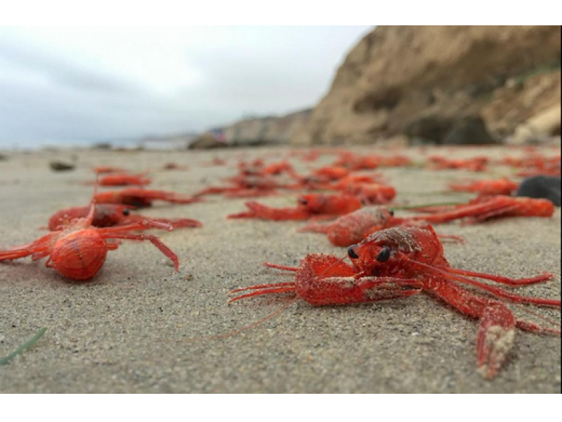

#Introduction to spatial analysis in R

This repository has the code and data files necessary for the introduction to spatial analysis in R workshop from August 27 and September 23 at 2015 at UCSB.

The code is stored in the `intro_spatial_data_R.Rmd` file. The code has been rendered using [knitr](http://yihui.name/knitr/) to create both a [PDF](https://github.com/jafflerbach/spatial-analysis-R/blob/master/intro_spatial_data_R.pdf) and an [.html](https://cdn.rawgit.com/jafflerbach/spatial-analysis-R/master/intro_spatial_data_R.html) to use as references rather than running the code again in the future.

**The objective is to learn how to use different types of spatial data to answer the scientific question:**

####What areas within the California Current are suitable for Red Tuna Crab aquaculture?

*Disclaimer: This is a completely made up scientific question. I very much doubt that red tuna crabs will be a viable aquaculture or wild caught resource and their environmental preferences are also entirely arbitrary.*
