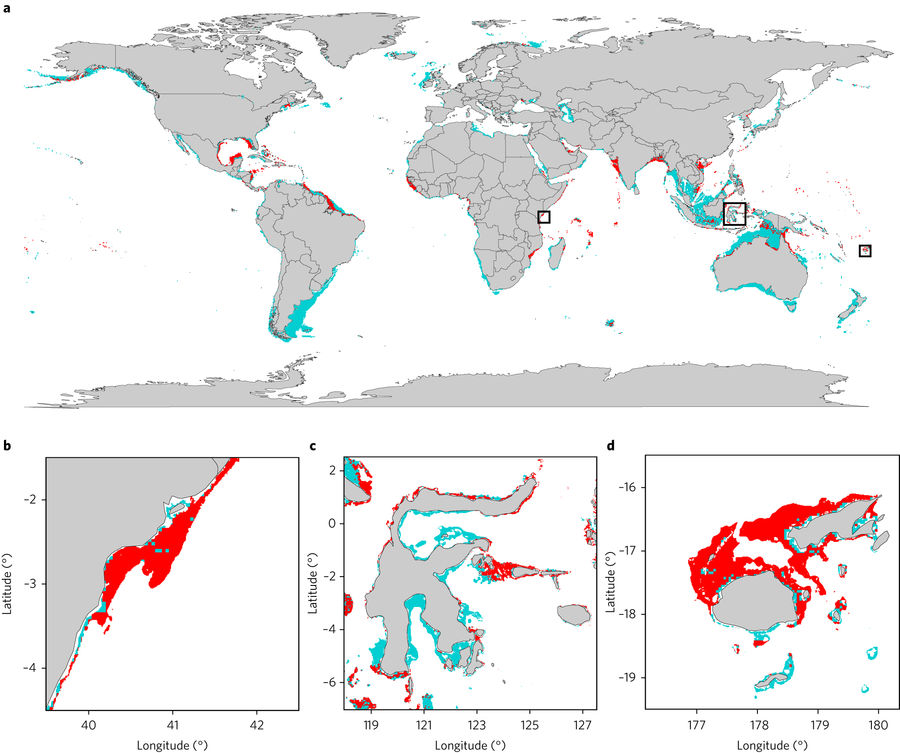
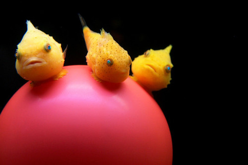

#Introduction

This is an introduction to Spatial Analysis in R. I've developed this code based on some common questions from friends and colleagues or ones that I've asked myself. There is a lot here to help you get started, but there is also **a lot** more to learn!

The focus here will be on raster analysis, rather than vector (shapefiles, polygons, polylines, points, etc.).
  
This (recently updated) tutorial is inspired by a recent paper in Nature Ecology and Evolution, [**Mapping the global potential for marine aquaculture**](https://www.nature.com/articles/s41559-017-0257-9). The authors used multiple constraints including ship traffic, dissolved oxygen, bottom depth and more, to limit areas suitable for aquaculture.

<br>



<br>
<br>

We are going to use a similar, but much more simplified approach here. We will map potential areas of marine aquaculture for the super cute Lump sucker fish (*Eumicrotremus orbis*)

<br>



<br>
<br>

We will answer this question by taking into consideration the following spatial data:  

**1. Sea Surface Temperature** (raster data)  
**2. Net Primary Productivity** (raster data)  
**3. Marine Protected Areas**  (vector data)  

Key information for optimal growth:  

- Sea surface temperatures between **12 and 18 degrees Celsius**  
- Net Primary Productivity between **2.6 and 3 mgC/m2/day**

```{r ,echo=FALSE,warning=F,message=F}

knitr::opts_chunk$set(warning=FALSE, message=FALSE)
options(scipen = 999)

library(png)
library(grid)
#setting margins for plotting
par(mar=c(2,2,1,1))
```
***

#Background

Raster or **gridded** data are stored as a grid of value which are rendered on a map as pixels. Each pixel value represents an area on the Earth's surface.


```{r, echo=FALSE}
img <- readPNG('images/raster_concept.png')
 grid.raster(img)
```

##Examples

Some examples of raster data include oceanographic datasets such as Sea Surface Temperature, land use maps and digital elevation maps.


```{r ,echo=FALSE}
img <- readPNG('images/examples.png')
 grid.raster(img)
```


##What is a GeoTIFF??

Raster data can come in many different formats. In this tutorial, we will use the geotiff format which has the extension `.tif`. A `.tif` file stores metadata or attributes about the file as embedded tif tags. These tags can include the following raster metadata:

  1. A Coordinate Reference System (`CRS`)
  2. Spatial Extent (`extent`)
  3. Values that represent missing data (`NoDataValue`)
  4. The `resolution` of the data

*Information in this section is borrowed from [NEON's Intro to Raster Data in R](http://neondataskills.org/R/Introduction-to-Raster-Data-In-R/) tutorial, another great resource*

***

#Setup  

##Libraries & Settings

There are a lot of spatial packages for R, we will touch on some of them here but not all of them. Here is brief overview, taken from [this site](http://geoawesomeness.com/r-goes-spatial/):  

* **raster:** Reading, writing, manipulating, analyzing and modeling of gridded spatial data  
* **rgdal:** Provides the most important and basic spatial functionalities. Provides bindings to Frank Warmerdam’s Geospatial Data Abstraction Library (GDAL) (>= 1.6.3, < 2) and access to projection/transformation operations from the PROJ.4 library   
* **sf** and **sp** are the most important R packages to handle vector data; **sf** is a successor of **sp**, but it's still evolvin
* **rgeos:** Provides spatial vector operations like buffer and intersect. Interface to Geometry Engine – Open Source (GEOS) using the C API for topology operations on geometries.  
* **maps**: This package has pre-loaded maps stored which can be added to your map plots. 
* **maptools:** tools for reading and writing spatial data (visualisation)  
* **ncdf4:** Use with NetCDF files. Note that the `raster` package is also able to read NetCDF files and I prefer to use `raster` whenever possible.  

Spatial data visualization packages

* **ggplot2:** With the recent incorporation of `sf` into ggplot2, you can now use `geom_sf()` to plot vector data.
* **leaflet:** Use leaflet in R to create interactive maps and visualize spatial data
* **tmap:** ggplot 2 for maps! A new package that gives Arc-like functionality to creating publication ready maps.
* **rasterVis:** a package that can be used to visualize raster data. Provides more functionality and customization than base plot for rasters.
* **mapview:** provides functions to create interactive visualisations of spatial data.


Load all libraries. If you do not have all of these libraries installed, use `install.packages()` to load them.

```{r libraries}

library(sf)
library(raster)       #Main raster library with nearly all functions used in this analysis
library(rgdal)        #Spatial library - most functions used from rgdal are for vectors (shapefiles)
library(dplyr)        #NOT spatial - this is a data wrangling library

#devtools::install_github("ecohealthalliance/fasterize")  #to install fasterize you need to run this line
library(fasterize)
#devtools::install_github("tidyverse/ggplot2")
library(ggplot2)

```  

***

# Data Prep

My first step in a spatial analysis is prepping the data, which includes the following:

- Read in data 
- Pre-process the data is it "plays nicely", 
- Visualize the data

## Shapefile

Read in the shapefile we'll use later on for the West Coast region.

```{r}

wc_rgns <- st_read(dsn = 'shapefiles', layer = 'wc_regions_clean')
plot(wc_rgns[1])

```


## Raster 

**Sea Surface Temperature**

In the `data` folder, there are 5 `.tif` files with the naming pattern `average_annual_sst_[year].tif`, which are 5 annual average sea surface temperatures for our region (2008-2012). We want just **one** raster file of the average SST over that time period.

### Visualize 

I like to visualize the raw data before running any calculation or analysis.

Create a raster of the first file by calling `raster()` and then `plot()` to visualize.  

```{r single_sst_layer}

r <- raster("rasters/average_annual_sst_2008.tif")

plot(r)
```
<br>
*Notice the data values are in Kelvin - we will change this to celsius later.*

I also like to look at the distribution of data using `hist()`

```{r histogram sst}
hist(r)
```


### Read in raster data

We want to read in all five Sea Surface Temperature files. I like to do this by first listing all the files with `list.files()`. 

```{r sst}
sst_files = list.files('rasters', pattern='average_', full.names = T) #We need full file paths

sst_files
```


### Stack rasters

To get a single layer of average SST in degrees Celsius we need to first `stack` all layers.

```{r stackImg,echo=F}

img <- readPNG('images/singletomulti.png')
grid.raster(img)

```


```{r calc avg SST}

#stack is a function from the raster package that puts all RasterLayers into a RasterStack
sstStack = stack(sst_files)

plot(sstStack)
```

### Raster calcuations

You can perform operations on a RasterStack by using the `calc()` function from the `raster` package. `calc()` lets you define a function to apply across all layers in the stack.

Calculate the mean value per cell and then convert to Celsius by subtracting 273.15.

```{r calc sst}

# By adding 'filename=' R will directly save the raster into the defined file rather than memory
sstAvg = raster::calc(sstStack, fun=function(x){mean(x, na.rm=T)-273.15})#,filename='rasters/sstAvg.tif', overwrite=T) 

plot(sstAvg, main = 'Mean Sea Surface Temperature (Celsius)')

```

A more compact way of doing multiple raster analysis is by using pipes...you can run `stack()` and `calc()` in one call!
```{r pipes sst}

sstAvg = stack(sst_files)%>%
          raster::calc(., fun=function(x){mean(x, na.rm=T)-273.15})

plot(sstAvg, main = 'Mean Sea Surface Temperature (Celsius)')
```


**Net Primary Production (NPP)**

#### Read in raster data   

Read in this data the same way as the SST data, using `raster()`. This data is the net primary production (mgC/m2/day).   
```{r avg npp}

npp = raster('rasters/annual_npp.tif');npp

plot(npp, main = 'Net Primary Production (mgC/m2/day)')

```

You'll see that this is in a different projection, extent and cell size from the SST data. It is really obvious when you look at the plot, but the summary above also gives clues as to what projection/resolution/extent this data is in.  

To do any sort of analysis using multiple rasters, they all need to be in the same extent, projection and cell resolution.

First look at the differences:
```{r}

sstAvg
npp

```

To get the primary productivity data in the same format as the SST data, we need to 

  1. `reproject`
  2. `crop`
  3. `resample`
  
### Reproject   

Use `projectRaster()` from the raster package to reproject a RasterLayer from one projection to another. You will need to define what the new projection should be by setting a coordinate reference system.  

Defining a **coordinate reference system (crs)** can be done in many ways. See [Melanie's great cheat sheet](https://www.nceas.ucsb.edu/~frazier/RSpatialGuides/OverviewCoordinateReferenceSystems.pdf) for more details about Coordinate Reference Systems.  

```{r crs,echo=F}

img <- readPNG('images/crs.png')
grid.raster(img)

```

Here, we want to project from *Mollweide* to *longlat*  

```{r reproject,warning=FALSE}

nppProj = projectRaster(npp, crs = ('+proj=longlat'));plot(nppProj)
```

### Crop  

Now that the layer is in the right projection, we need to crop it to our study area and make sure all raster layers have the same extent. 

You can set the extent using `extent()`. You can also use another raster object to define the extent (in this case we will use sstAvg)

```{r crop}

nppCrop = crop(nppProj, sstAvg) #crop nppProj to the extent of sstAvg
plot(nppCrop)

```

### Resample    

Just by plotting both the sea surface temperature and primary productivity data, you can tell right away that these two datasets have different cell resolutions. The NPP data needs to be resampled to the same cell size as SST in order to do any sort of analysis on these two. Use the *nearest neighbor* method to avoid interpolation between points. We want to keep the data values the same as the original data, but at a higher resolution.  

Here you can see the difference:

```{r resample,message=F,warning=F,quiet=T,verbose=F,results=F}

#include progress='text' in any raster function to see a progress bar as the function runs! This is one of my favorite R things!
npp_res = resample(nppCrop, sstAvg, method='ngb')#,progress='text')
npp_bil = resample(nppCrop, sstAvg, method='bilinear')#,progress='text')

par(mfrow=c(1,2))
plot(npp_res);plot(npp_bil)
```  

  
*NOTE: Typically you'll want to disaggregate cells to match data of a higher resolution. Otherwise, if we aggregate the cells from the SST data, we would lose data.*  

Again we can condense this script by using pipes!  
```{r pipes npp,warning=F}

npp_res = projectRaster(npp, crs=('+proj=longlat')) %>%
          crop(sstAvg) %>%
          resample(sstAvg, method='ngb') #,progress='text')

plot(npp_res)

```

#### Check prepped data  

Check to see that we can use the SST and NPP data together now
```{r stack data}

stack(npp_res, sstAvg) #No error and the stack has two layers so it looks good!

```

***

# Analysis   

Now that our data is prepped and guaranteed to play nicely, we can move onto the fun stuff - **analyzing the data**. For this specific analysis, we need to use the SST and NPP data to find areas along the US West Coast that are suitable for growing lumpsucker fish. This requires removal of all cells from NPP and SST that are not within the ideal growth parameter range.


## Reclassify Cells

**Sea Surface Temperature**

Remove all cells from the Sea Surface Temperature layer that fall out of the species temperature range

Lumpsucker fish grow best in waters that are **between 12 and 18 degrees Celsius.**  

Remembering that `sstAvg` is our current SST layer, you can eliminate all cells with values outside of your range in a few different ways. 

Let's take a look again at our SST data layer.
```{r}
plot(sstAvg)
```

We want to set all cell values outside of our preferred range to be equal to `NA`. We can do this by using `raster::reclassify()`. I'm creating a new object called `sstPref` (preferred sst cells). The `reclassify()` function takes the raster layer as it's first argument, and then a reclassification matrix which must have 3 columns with the third column indicating the new cell value. The way this is written, I've stated that all cells with values from `-Inf` to 12 will be assigned an `NA`, all cells between 12 and 18 will be assigned a value of **1** and any greater than 18 will be reclassified to `NA`.

```{r sst_reclassify}
sstPref <- reclassify(sstAvg, c(-Inf, 12, NA,  
                                12, 18, 1,
                                18, Inf, NA))

plot(sstPref, main = 'Mean Sea Surface Temperature (Celsius)')
```


**Net Primary Production**

We can do the same with the Net Primary Production data. Lumpsucker fish prefer water with a mean primary production of **between 2.6 and 3 mgC/m2/day**

```{r}

plot(npp_res)

#define your range and the output value within the reclassify() function as the second argument 
nppBin <- reclassify(npp_res, c(-Inf, 2.6, NA,
                                2.6, 3, 1,
                                3, Inf, NA))

plot(nppBin, col='darkorchid2', main='Areas with Suitable NPP')

```

### Combine rasters with overlay()

Now that we have these two binary layers, we can combine them using `overlay()` from the raster package and the resulting cells, equal to 1, are the cells that meet both SST and NPP requirements
```{r}

cells = overlay(sstPref, nppBin, fun=function(x, y){x*y})
plot(cells, col='lightblue', main='Suitable Aquaculture Areas')
plot(wc_rgns, add = T)

```
***  

**SIDE NOTE:**  
You can perform mathematical operations on single or multiple raster layers using base R functions. Both `calc()` and `overlay()` are useful when you have complex functions working on these layers. Here are some examples of how you can use raster layers with base R functions:

```{r}
#sum
sum = sum(sstPref, nppBin, na.rm=T);plot(sum) #gives you cells equal to 0, 1 and 2. 

#average
avg = mean(sstAvg, npp_res);plot(avg)
```
***  

#Additional Functions  

This could be all you need - but I want to show some additional steps to highlight more functionality in R.  
  
  
### Mask  

You can remove cells outside of your region by using the `mask()` function. Here, you only want to keep cells that are within the Mexican or US EEZs. The `mask()` function takes the raster you're looking to remove cells from as it's first argument, then either another *raster* or a *spatial* object as the object used to mask out cells. Here we will use the West Coast shapefile as our mask (I also think of this as a cookie cutter, removing pieces outside of the shapefile boundary).

```{r mask}
plot(cells, col='lightblue')
```

The `raster` package does not yet play nicely with Simple Features, so we need to convert the shapefile, `wc_rgns` into a **SpatialPolygonsDataFrame** using the function `as()`. Then we can feed this shapefile into the `mask()` function.

```{r}
wc_rgns_sp <- as(wc_rgns, 'Spatial');plot(wc_rgns_sp)

cellsEEZ = mask(cells, wc_rgns_sp)

plot(cellsEEZ, col='lightblue', main = 'Suitable Aquaculture Areas');plot(wc_rgns, add = T)
```

### Crop to region

You can then crop your raster to a smaller extent
```{r}

cellsCrop = crop(cellsEEZ,extent(-130, -115, 30, 43)) #setting extent by eyeing it
plot(cellsCrop,col='lightblue', main = 'Suitable Aquaculture Areas');plot(wc_rgns, add=T)

```

  
With any raster analysis, you likely aren't just creating a pretty map. Here is an example of running **zonal statistics** on a raster.  

We want to look at the total area (km2) in each region that is suitable for Lumpsucker aquaculture.  

### Rasterize Shapefile

First we need to turn the shapefile of our region into a raster of the same projection/extent/resolution as your cells. Again, we will need to use the **SpatialPolygonsDataFrame**.


```{r rasterize}

#let's take a look at what the West Coast dataframe looks like again
head(wc_rgns_sp)

#
wcZones <- fasterize(wc_rgns, cellsEEZ, field = "rgn_id")#,progress='text')
wcZones
plot(wcZones, main = 'Shapefile rasterized into zones')

```  

### Zonal Statistics

To get the total viable area for aquaculture along the West Coast, run `zonal()` using `wcZones`. The `zonal()` function is given any sort of function you define including sum, mean, max, etc.  

Since the current values of `prefRas` are all equal to 1, we can simply sum up the number of cells in each EEZ.

```{r zonal}
par(mfrow = c(1, 2))

plot(cellsEEZ, col='lightblue', main='Suitable Aquaculture Areas');plot(wcZones, main='US West Coast zones')

cellsSum = zonal(cellsEEZ, wcZones, fun='sum') #total number of cells since they are all equal to 1

cellsSum

```

### Calculate area() per cell

But that isn't as useful as calculating the actual area in km2. Using the `area()` function from the `raster` package you can create a new raster with cell values equal to their area, and then run `zonal()`.  

```{r area zonal}

cellsArea = area(cellsEEZ, na.rm=T);plot(cellsArea, main='Cell area (km2)') #gives are in km2

area = zonal(cellsArea, wcZones, fun='sum');area
```


### Visualize results with ggplot and `geom_sf()`

```{r}

area <- as.data.frame(area) %>%
        rename(rgn_id = zone,
               suit_aq_area = sum)

west_coast_aq <- wc_rgns %>%
                  left_join(area)

ggplot(west_coast_aq) +
  geom_sf(aes(fill = suit_aq_area)) +
  theme_bw() +
  labs(fill = "Area (km2)",
       title = "Suitable area for Lumpsucker fish aquaculture") +
  scale_fill_distiller(palette = "Blues", direction=1) #direction can be used to reverse the color palette scale


```
